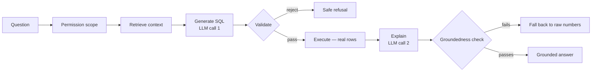
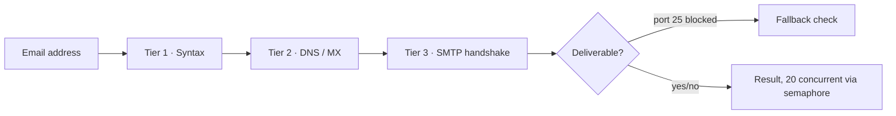

<!-- ============================================================
     HERO
     Regenerate the two custom pieces below (ascii portrait + info
     card) with: python scripts/make_ascii_svg.py / make_info_card.py
     The banner + typing line are external services (capsule-render,
     readme-typing-svg) -- see the note at the bottom of this file.
     ============================================================ -->

 

## `whoami`

<table>
<tr>
<td valign="top" width="43%"></td>
<td valign="top" width="57%"></td>
</tr>
</table>

Final-year **Data Science** undergraduate (Minor: Finance) at UPES, currently splitting time between an AI product/analytics internship at **Polluxa** and a data science internship at **Gravity Engineering** — on top of two earlier internships at **Maruti Suzuki India Ltd.** Comfortable moving from a SQL query to a Power BI dashboard to a FastAPI backend to an LLM-grounded pipeline, and have had insights reviewed at General Manager and founder level along the way. Looking for full-time or new internship roles in **Data Science, ML/AI Engineering, or Financial Analytics.**

 

## Tech Stack

**AI / ML**

**Data / BI**

**Backend / Cloud**

 

## AI / ML Focus

Two threads run through most of what I build: **grounding LLM output in something verifiable**, and **applying classical ML where the cost of being wrong is real** (markets, business reporting). [Sightline](https://github.com/Kartik281204/sightline-modded) is the first — a 5-step pipeline (permission scope → context retrieval → SQL generation → deterministic validation & execution → explanation with a groundedness check) built specifically so the Claude API never states a number it didn't just get from a real, executed query. The [S&P 500 pipeline](https://github.com/Kartik281204/financemodelling-predictionmodel) is the second — 63 leakage-safe features and a walk-forward CV setup built to survive contact with 90 years of real market data, not just a backtest that looks good once.

 

## Featured Projects

<b>🔭 Sightline — Grounded AI Analytics Copilot</b>

 

`Python` `FastAPI` `PostgreSQL` `Next.js/TypeScript` `Docker` `Anthropic API`

Architected a 5-step grounded AI-query pipeline using FastAPI, PostgreSQL, and the Claude API so the model's plain-English answers are checked against real, executed SQL before they ship — a wrong-but-confident number gets caught and replaced with the raw result instead of going out.

- Permission-scoped semantic layer — role-based access is enforced structurally, not just prompted for
- A deterministic groundedness gate re-checks every number in the generated explanation against the actual query result
- **Identified and patched a real permission-bypass vulnerability during development; shipped with full CI coverage**

**[→ View Repository](https://github.com/Kartik281204/sightline-modded)**

<b>📈 S&P 500 Direction Prediction — Production ML Pipeline</b>

 

`Python` `Pandas` `Scikit-learn` `XGBoost` `LightGBM` `NumPy`

Production ML pipeline predicting S&P 500 daily direction on 90 years of market data (1927–2019); benchmarked 5 classifiers via 6-fold expanding-window walk-forward cross-validation — the same discipline a real trading desk would demand before trusting a backtest.

- 63 leakage-safe technical features across price, momentum, volatility, trend, and volume
- Verified zero look-ahead bias via a custom automated test suite, not just a visual sanity check

**[→ View Repository](https://github.com/Kartik281204/financemodelling-predictionmodel)**

<b>📧 Bulk Email Verifier — Production API</b>

 

`Python` `FastAPI` `asyncio` `aiosmtplib` `dnspython`

Production-grade 3-tier bulk email verifier (Syntax → DNS/MX → SMTP handshake) built with FastAPI and asyncio; semaphore-bounded concurrency handles 20 simultaneous checks without triggering spam filters.

- Catch-all domain detection, plus a Tier 3 fallback for when port 25 is blocked
- Deployed on Render and Railway with a live health-check API

**[→ View Repository](https://github.com/Kartik281204/anti-agenticAI-CRMprotocol)**

<b>📊 Employment Tracker Beta — Job Search & Skill Analytics Platform</b>

 

`JavaScript` `HTML/CSS` `Electron` `localStorage`

A self-tracking platform computing a weighted employment-likelihood score across DSA progress (156 problems / 12 topics), resume quality, consistency, and applications.

- Shipped as both a browser app and a packaged Electron desktop app
- AI-coach briefings, skill radar charts, and activity heatmaps

**[→ View Repository](https://github.com/Kartik281204/employment-tracker-beta)**

 

## Professional Experience

<table>
<tr><td width="140" valign="top"><b>Jun 2026 – Present</b></td><td>

**AI Product & Business Analyst Intern (Team Lead)** · Polluxa · *Remote, part-time*
Own analytics and CRM workflows across a 3-product portfolio, turning KPI insights into recommendations presented directly to the founder. Automated data collection, preprocessing, and reporting in Python and SQL, cutting manual reporting time ~60% across 5 weekly workflows.

</td></tr>
<tr><td valign="top"><b>Jun 2026 – Present</b></td><td>

**AI Product & Data Scientist Intern** · Gravity Engineering Services · *Remote, part-time*
Backend development and database optimization strengthening performance and reliability across core systems; contributed to Polluxa's core product and engaged directly with clients and board members on project updates.

</td></tr>
<tr><td valign="top"><b>Dec 2025 – May 2026</b></td><td>

**Business Analyst Intern** · Maruti Service Masters — JJ Impex Delhi Ltd. (Maruti Suzuki) · *Delhi*
Six months of business and data analysis for a Maruti Suzuki subsidiary; designed and maintained recurring KPI reports that improved cross-departmental management visibility.

</td></tr>
<tr><td valign="top"><b>Jun 2024 – Nov 2024</b></td><td>

**Data Analyst Intern** · Maruti Sales & Service Delhi — Maruti Suzuki India Ltd. · *Delhi*
Queried and extracted data via SQL across multiple databases; built Power BI dashboards for senior leadership across 3 business units. Recognized by the General Manager for strong analytical performance.

</td></tr>
<tr><td valign="top"><b>Jun 2024 – Aug 2024</b></td><td>

**Web Development & Research Intern** · Laadli Foundation · *Delhi*
Shipped 3 live features across the Foundation's e-commerce and fundraiser platforms; collected and validated 5,000+ field research records supporting impact reports.

</td></tr>
</table>

 

## Recognition

- 🏅 Commended **by name by the General Manager**, Maruti Sales & Service Delhi, for analytical performance — documented in a formal completion certificate
- 🏅 Business recommendations and KPI insights presented directly to **founder and board-level stakeholders** at Polluxa and Gravity Engineering
- 🏅 **Zero look-ahead bias**, verified by a custom automated test suite, across 90 years of financial data in the S&P 500 pipeline

 

## GitHub Activity

<!-- refreshed daily by .github/workflows/update-profile-art.yml — real data, no third-party API -->

 
 

## Current Focus

`Data Analyst` → `Business Analyst` → `AI Product & Data Scientist` → *(targeting)* `ML / AI Engineer`

- 🔭 Extending **Sightline**'s grounded-query approach — the harder problem now is verification and permission-scoping, not just SQL generation
- 📈 Applying the same walk-forward-validation discipline from the S&P 500 pipeline to new financial ML questions
- 🎓 Finishing my B.Tech in Data Science (Minor: Finance) at UPES, expected June 2027
- 🤝 Open to full-time and internship roles in Data Science, ML/AI Engineering, or Financial Analytics

 

## Connect

 

Portrait + info card generated from a real photo via a local Python pipeline (background removal, CLAHE contrast, ASCII conversion) — see <code>scripts/</code>. Contribution graph scraped live from github.com, no third-party API. Banner and typing line are external SVG services (capsule-render, readme-typing-svg) and will occasionally have downtime, per their own maintainers.

